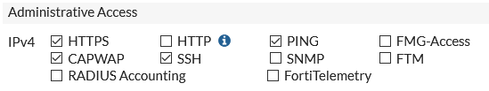

# COMANDOS DE CONFIGURACION DE FORTIGATE
## ¿QUÉ ES UN FORTIGATE?

Los **Firewall Fortinet** (también conocidos como firewalls de próxima generación NGFW o simplemente *FortiGate*) son dispositivos de seguridad que permiten la creación de redes seguras y proporcionan una protección amplia, integrada y automatizada contra amenazas emergentes y sofisticadas.

## COMANDOS BÁSICOS PARA CONFIGURACIÓN DE FORTIGATE
### HOSTNAME

```
    config system global     // Entramos a las configuraciones globales
    set hostname [nombre]    // Definimos el Hostname
```

### VER CONFIGURACIÓN DE INTERFACES

```
    config system interface     // Entramos a la configuracion de las interfaces
    show                        // Listamos las interfaces
```

#### VER CONFIGURACIONES DE UNA INTERFAZ ESPECIFICA

```
    config system interface         // Entramos a la configuracion de las interfaces
    edit [nombre de la interfaz]    // Nos metemos a la configuracion de la interfaz especifica
    show                            // Mostramos configuracion
```

### CONFIGURAR UNA IP INTERNA DE GESTION

```
    config system interface     // Entramos a la configuracion de las interfaces
    edit [nombre interfaz]      // (edit internal) Nos metemos a la configuracion de la interfaz especifica
    set ip [IP][máscara de red] // (set ip 10.10.100.1 255.255.255.0)
```

### CONFIGURAR UNO O MAS PROTOCOLOS DE ACCESO DE GESTION

Si queremos gestionar nuestro FW, podemos habilitar el protocolo que queramos de los siguientes que tenemos disponible.



Si queremos habilitar uno o varios, ejecutamos:

```
    set allowaccess [Protocolo]         // Habilitamos el/los protocolos
    set allowaccess  https ssh ping     //EJEMPLO
```
